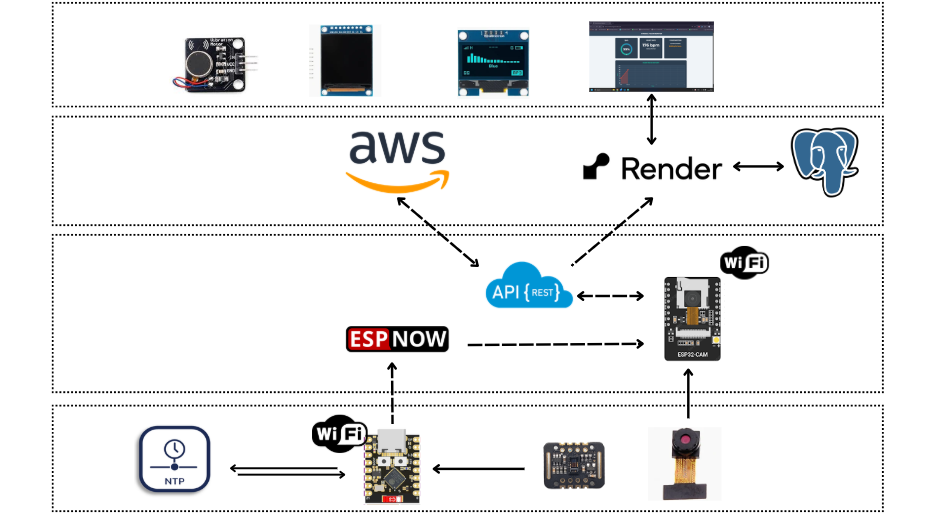

# Stress & Focus Monitor
A wearable and desk-based monitoring system developed for tracking user stress levels, heart rate, SpO2, and emotional state. The system uses ESP32 devices to collect biometric data from a wearable sensor, detect emotions via camera on a desk unit, and send aggregated data to a cloud-hosted dashboard for real-time visualization. Data is stored in a database and accessible via a web interface.

## Table of Contents
- [Features](#features)
- [Hardware Requirements](#hardware-requirements)
- [Software Requirements](#software-requirements)
- [Configuration](#configuration)
- [Setup and Deployment](#setup-and-deployment)
- [Troubleshooting](#troubleshooting)
- [Other](#other)
- [Project Structure](#project-structure)

## Features
- **Biometric Sensing**: Tracks heart rate (BPM), blood oxygen saturation (SpO2), and stress levels (Normal, Gradual Stress, Stress Spike) using a MAX30105 sensor on a wearable ESP32.
- **Emotion Detection**: Uses an ESP32-CAM on the desk unit to capture photos, send them to an AI endpoint for emotion analysis (e.g., happy, sad) with confidence scores.
- **Wireless Data Transfer**: Wearable sends data to desk unit via ESP-NOW; desk unit aggregates with emotion data and sends to server via HTTP.
- **Displays**: OLED on wearable for real-time vitals; TFT display on desk for comprehensive readout including encouraging messages based on stress level.
- **Web Dashboard**: Real-time UI with SpO2 gauge, heart rate display, status, emotion result, and a line chart for heart rate history.
- **Polling Updates**: Dashboard polls the server every 5 seconds for live updates.
- **Baseline Calibration**: Wearable calibrates a baseline heart rate during initial readings to detect stress thresholds.
- **Deployment-Ready**: Adapted for Render hosting with PostgreSQL support; handles data sending from ESP32-CAM. 

## Hardware Requirements
- Wearable Unit:
  - ESP32 Development Board (e.g., ESP32-WROOM-32)
  - MAX30105 Pulse Oximeter Sensor (for SpO2 and BPM)
  - SSD1306 OLED Display (128x64)
  - Jumper wires, breadboard, and power supply (3.3V/5V)
- Desk Unit:
  - ESP32-CAM Board (with OV2640 camera)
  - TFT Display (compatible with TFT_eSPI library)
  - Jumper wires and power supply

Optional: Vibration motor for haptic feedback on wearable (commented out in code).

## Software Requirements
- Arduino IDE or PlatformIO for programming the ESP32 devices
- Node.js (v16+) and npm for the backend server
- Arduino Libraries:
  - WiFi
  - esp_now
  - esp_wifi
  - esp_camera
  - TFT_eSPI (for desk TFT)
  - Adafruit_SSD1306 and Adafruit_GFX (for wearable OLED)
  - MAX30105 and spo2_algorithm (for pulse oximeter)
  - HTTPClient
- Node.js Dependencies (listed in package.json):
  - express
  - cors
  - dotenv
  - mysql2 (for local MySQL)
  - pg (for Render PostgreSQL)
- Frontend Libraries:
  - Chart.js (loaded via CDN in index.html)
## Configuration
- ESP32 code:
  - `ESP32/Wearable_Connection/config.h`: Change to the WiFi credentials you wish to use.
  - `ESP32/desk_connection/config.h`: Change to the WiFi credentials you wish to use, update API endpoints, follow instructions in the file.
- Backend:
  - Update .env with your database credentials:
    - For local: DB_HOST=localhost, DB_USER=root, DB_PASSWORD=yourpassword, DB_NAME=stress_monitor
    - For Render: Use PostgreSQL credentials from Render dashboard (host includes 'postgres').
- AI Endpoint: replace with your own instance's endpoint
- Render Deployment: See Setup and Deployment below.

## Setup and Deployment
### 1. Hardware Setup:
- Wire wearable: check etc/Wring.md for detailed wiring.
- Wire desk: check etc/Wring.md for detailed wiring.
- Flash Wearable_Connection.ino to wearable ESP32 and desk_connection.ino to ESP32-CAM.
### 2. Local Testing:
- Install Node.js dependencies: `npm install`.
- Start server: npm start (runs on port 3000).
- Open index.html in browser or access http://localhost:3000 (serves static files).
- Test data sending: Power on devices; wearable sends to desk, desk to server. Verify in DB and dashboard.
### 3. Deploy to Render:
- Create a Render account and new Web Service.
- Connect your Git repo (push this project to GitHub/GitLab).
- Set Runtime: Node.js.
- Build Command: npm install.
- Start Command: node server.js.
- Add Environment Variables: From .env (e.g., DB_HOST, DB_USER, etc.).
- Create a PostgreSQL database on Render: Attach it to the service via internal URL (update .env with Render's Postgres creds).
- Deploy: Render builds and hosts at a URL like https://stress-monitoring.onrender.com.
- Update ESP32 code: Change server URL in desk_connection.ino to your Render URL (e.g., https://your-app.onrender.com/api/data).
- Access dashboard: Open Render URL in browser (serves index.html).
### 4. Test Connections:
- WiFi: Devices connect to specified SSID.
- ESP-NOW: Wearable to desk (check Serial logs for "ESP-NOW sent: OK").
- Data Sending: Desk to Render (check Serial for "Full data sent → HTTP 200", verify in Render DB).
- Dashboard: Polls /api/latest and /api/history; chart shows BPM over time.

## Troubleshooting
- Camera Init Fails: Check wiring; add retries, then restarts.
- ESP-NOW Fails: Ensure same WiFi channel; check MAC addresses.
- DB Connection: Verify .env creds; use pg for Render, mysql2 locally.
- No Data on Dashboard: Check polling (console logs), server logs on Render.
- Emotion Detection: Ensure AI endpoint is up; fallback to "----" if no face.
- Render Deployment Issues: Check Render logs for DB connection errors; ensure SSL is enabled for Postgres.

## Other
- You can use `stress_sim_demo.py`to run simulation before adjusting `alpha` value to match your demands.

## Project Structure
